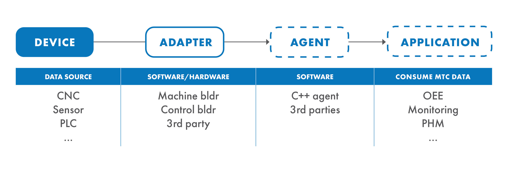
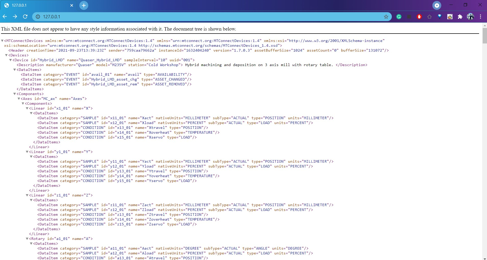

# MTConnect Dockerisation

The [MTConnect](https://www.mtconnect.org/) standard defines data tags and the behavior of a software agent.




Current and archive releases of the spec are free and publicly available, housed at and maintained by the [MTConnect Institute](www.mtconnect.org/documents)

Free, open source developer tools are on [GitHub and community-maintained](github.com/mtconnect/).

## CPPAgent binary file image

For the binary cppagent dockerisation, we used the powershell image on the windows daemon. For information about switch between different daemon, please reference the [docker windows document](https://docs.docker.com/desktop/windows/)

## 1 Download file 
Pre-built binary releases for Windows are available from this [Releases](https://github.com/mtconnect/cppagent/releases) page. Download the zip file and unzip into your local folder.

To make sure the agent run correctly, you need to put the configuration file agent.cfg into the bin folder and relative xml configuration file into the root cppagent folder.

## 2 The docker file

The Dockerfile for this image on windows platform.

```sh

FROM mcr.microsoft.com/powershell:lts-nanoserver-2004-20210819	

#ENV CPPAGENT_BASE = c:\\cppagent_win32
WORKDIR C:\\cppagent
COPY . .
CMD c:\cppagent\bin\agent.exe debug

```

## 3 Build 
Put the Dockerfile into the cppagent foler and run the following command.

```sh
docker build -t cppagent .
```

## 4 Run the image

Once build finish, you can run the image via. Port 5000 is the docker container port that defined in agent.cfg file. Port 80 is the hostmachine port for exposed visit.

```sh
docker run -p 80:5000 -d cppagent
```

## 5 Connect via browser

Once the cppagent is running, you can monitor the connection and data flow via a browser.

